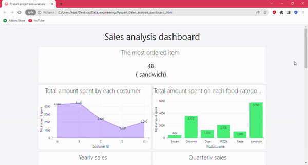

# Sales Analysis Project

This project was developed in PySpark using the [Databricks](https://www.databricks.com/) tool. Two different files containing information about food orders from various locations were analyzed, with the aim of processing the data analysis to extract relevant and valuable insights.

## File Contents:

[menu.csv](menu.csv.txt): Text file containing information about product_id, product_name, and price.

[sales.csv](sales.csv.txt): Text file containing information about customer_id, product_id, order_date, location, and order_source.

[Sales_analysis_notebook](Sales_analysis_notebook.ipynb): Notebook extracting information such as Total amount spent by each customer, Total amount spent on each food category, Total amount of sales in each month, Yearly sales, Monthly sales, Quarterly sales, How many times each product has been purchased, Top 5 ordered items, Top ordered item, Number of times each customer ordered, Frequency of customers that order from the Restaurant, Total sales by each country, Total sales by order_source.

[Databricks](https://www.databricks.com/) provides the choice to create a dashboard that shows the findings graphically:

  

***
It's also possible to download the raw HTML files of the framework and the dashboard and upload them directly into your [Databricks](https://www.databricks.com/) account:

[Sales_analysis_pyspark](Sales_analysis_pyspark.html): HTML version of the file [Sales_analysis_notebook.ipynb](Sales_analysis_notebook.ipynb).

[Sales_analysis_dashboard](Sales_analysis_dashboard.html): HTML file displaying graphical results of the data extracted.
